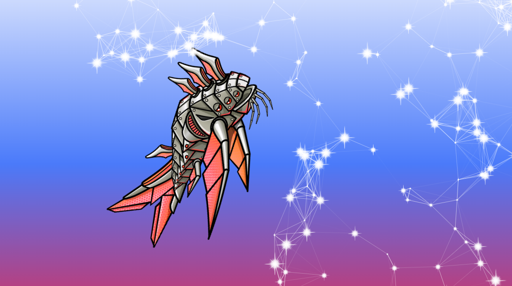

# Space-bug-animation

**Space-bug-animation** is an interactive animation created using **plain vanilla JavaScript**. The animation simulates interactions between particles and larger objects, such as "creatures" or "space bugs." It features randomized sprite animations and uses the `requestAnimationFrame` method for smoother and more efficient animations.

## Features

- **Interactive Particle Simulations**: Particles interact with larger objects (creatures/space bugs), creating a dynamic and engaging experience.
- **Randomized Sprite Animations**: The space bug's movements are randomized, providing varied and unpredictable behavior.
- **Smooth Animations**: Utilizes `requestAnimationFrame` timestamps for more efficient and smoother animations, ensuring better performance.
- **Vanilla JavaScript**: Built without any external libraries, using only vanilla JavaScript to handle animations and interactions.
  
## Live Demo

Check out the live demo [here](https://algomystique.github.io/Space-bug-animation)

 

## Installation

 Clone the repository:
   ```
   git clone https://github.com/yourusername/Space-bug-animation.git
   cd Space-bug-animation
   ```
## Usage
Interact with the Animation: The space bug interacts with the particles that randomly appear on the canvas, creating a dynamic and engaging scene.

Randomized Behavior: Every time the animation runs, the sprite's movement and particle interactions will vary for a more natural feel.

## Technologies Used

HTML5: Basic structure and canvas element.

CSS: Basic styles for layout and design.

JavaScript: Core logic for handling animations, particles, and space bug interactions.

## License
This project is licensed under the MIT License - see the LICENSE file for details.


